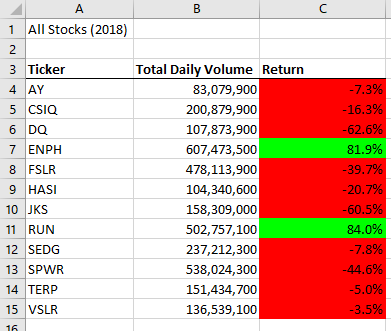

# Stock Analysis with VBA

## Overview

### Purpose
Use VBA to make an analysis on multiple stocks by providing their returns and their total daily volumes for the years of 2017 and 2018. 
We did this using:
* input boxes
* for loops
* timer
* if statements
* variables of different data types
* arrays
* MsgBox
* etc.

### Background
Steve was impressed with the previous analysis workbook for the DQ stock and would like to expand the datasetand recieve an analysis of all stocks over 2017 and 2018.

## Results
During 2017 all stocks were doing well other than TERP, but in 2018 all stocks did bad other than ENPH and RUN. Both ENPH and RUN did well when looking at both years **(ENPH: 136.3% in 2017 and 97.9% in 2018, RUN: 9.5% in 2017 and 85.2% in 2018)**, but ENPH by far had the best returns.

 

The original VBA code ran at around **.38 seconds**, which may not seem slow, but could be made faster with refactoring.

The new refactored VBA code ran at around **.04 seconds**, which is significantly faster.

.png)

The new refactored code seems to run almost **10 times faster** than the original code. The main reason for this improvement, is the more efficient looping of the data. The original code looped through the dataset 12 times(once for every ticker), but the new refactored code looped through the dataset only one time. It did so by storing data for each ticker as it worked through the dataset.

## Summary

Some advantages of refactoring code is that it can allow for much faster run time and more user friendly results. Some disadvantages would be that refactoring code can sometimes be time consuming, and working out the logic of the code can be a headache depending on what type of project a person is doing.

In the case of this project, the main advantage of refactoring the code was that the runtime was much faster. The disadvantage is that it took a while to think out the logic and get the code in working condition as there were a lot of moving parts.
